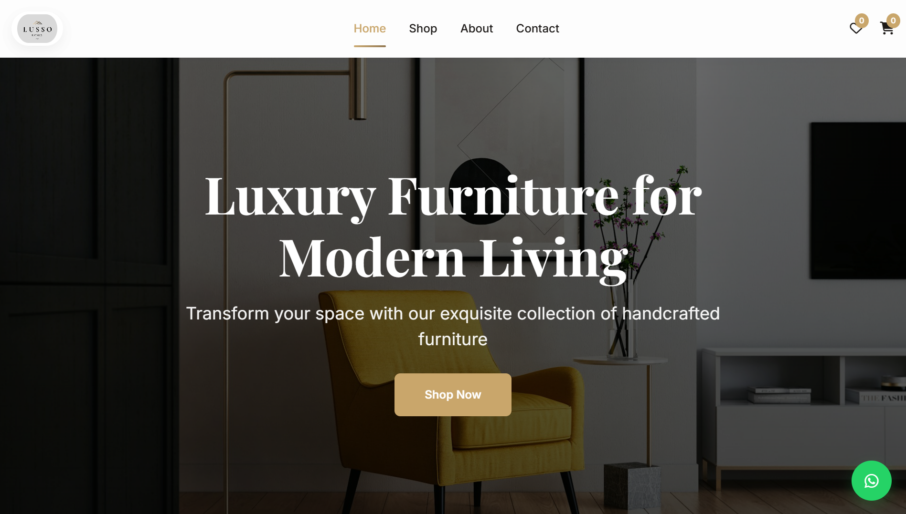

# 🏰 Lusso Homes - Augmented Reality Furniture Experience

> **Experience luxury in your own space.** A premium e-commerce platform featuring immersive Augmented Reality (AR) that lets customers place furniture in their homes before buying.
[](https://lussohomes.in)
[](https://developers.google.com/ar)
[](https://modelviewer.dev)

---

## 🌟 Overview

**Lusso Homes** redefines online furniture shopping by bridging the gap between digital browsing and physical reality. Built with a focus on high-end aesthetics and user experience, this application allows users to browse a curated collection of luxury furniture and view high-fidelity 3D models in their actual environment using WebXR and native AR technologies.

---

## ✨ Key Features

### 🛍️ Premium E-Commerce Experience
- **Modern UI/UX**: Designed with a "Luxury First" philosophy using Glassmorphism, smooth transitions, and a sophisticated color palette (`#d4af37` Gold & `#1a1a1a` Black).
- **Dynamic Catalog**: Robust JavaScript-based product rendering supporting categories like Sofas, Beds, Dining, and more.
- **Responsive Design**: Flawlessly adapts to Desktops, Tablets, and Mobile devices.

### 👓 Advanced Augmented Reality (AR)
- **"View in Your Room"**: One-click AR activation using Google's `<model-viewer>`.
- **Drift-Free Tracking**: Optimized `scene-viewer` integration for rock-solid model placement on Android.
- **Interactive Controls**:
  - **Pinch to Zoom**: Scale furniture to your desired size.
  - **Drag to Rotate**: View from all angles.
  - **Tap to Place**: Position models on detected surfaces (floors, tables).
- **Lighting Estimation**: Models react to real-world lighting for realistic shadows and reflections.

### � Device Compatibility

| Platform | AR Support | Tech | Status |
|----------|------------|------|--------|
| **Android** | ✅ Full Support | Scene Viewer / WebXR | **Working Perfectly** |
| **iOS** | ℹ️ Limited | AR Quick Look | Requires `.usdz` files (currently `.glb` only) |
| **Desktop** | ❌ No AR | 3D Interactive Viewer | 3D Spin & Zoom works |

---

## 🛠️ Technology Stack

| Component | Technology | Description |
|-----------|------------|-------------|
| **Core** | HTML5, CSS3, ES6+ | Semantic structure and modern vanilla JS logic. |
| **AR Engine** | `<model-viewer>` | Google's web component for 3D & AR rendering. |
| **Styling** | Custom CSS | Variables, Flexbox/Grid, and media queries. |
| **Backend** | Python (`http.server`) | Custom threaded server with caching logic. |
| **3D Formats** | `.glb` (Android/Web) | Industry standard binary format for 3D web. |

---

## 🚀 Getting Started

Follow these steps to set up the project and test AR capabilities.

### Prerequisites
- **Python 3.x** installed.
- A mobile device (Android recommended) for AR testing.
- **Ngrok** (Recommended for AR testing) or a local network connection.

### Installation

1.  **Clone the Repository**
    ```bash
    git clone https://github.com/amaanshaikh711/Lusso-Homes-Ecommerce-Website.git
    cd Lusso-Homes-Ecommerce-Website
    ```

2.  **Start the Local Server**
    ```bash
    python server.py
    ```
    This will serve the site at `http://localhost:8080`.

---

## 📱 AR Testing Guide

Augmented Reality features often require a secure context (HTTPS) or specific network conditions to work on mobile devices.

### Method 1: Using Ngrok (Recommended)
This creates a public HTTPS URL, ensuring the best compatibility with Android's Scene Viewer.

1.  Download [ngrok](https://ngrok.com/download).
2.  Start your local python server (`python server.py`).
3.  In a separate terminal, run:
    ```bash
    ngrok http 8080
    ```
4.  Copy the `https://...` URL provided by ngrok.
5.  Open this URL on your phone's Chrome browser.
6.  Select a product (e.g., "Velvet Charm Modern Sofa") and tap **"View in Your Space (AR)"**.

### Method 2: Local Network (WiFi)
If you don't use ngrok, you can connect via your computer's IP address.

1.  Ensure your phone and computer are on the **same WiFi**.
2.  Find your computer's IP address (e.g., `192.168.1.X`).
3.  On your phone, visit: `http://192.168.1.X:8080`.
4.  **Important**: If the camera doesn't open, you may need to enable insecure origins in Chrome:
    - Go to `chrome://flags` on your phone.
    - Search for "Insecure origins treated as secure".
    - Enable it and add your IP: `http://192.168.1.X:8080`.

---

## 📂 Project Structure

```bash
Lusso-Homes/
├── css/             # Stylesheets (index.css, responsive.css)
├── js/              # Logic (app.js, products.js, ar-view.js)
├── models/          # 3D Assets (.glb)
├── img/             # Images & Icons
├── pages/           # HTML Pages
├── server.py        # Python Development Server
└── README.md        # Documentation
```

---

## 🤝 Contributing

We welcome contributions!
1. Fork the Project.
2. Create your Feature Branch (`git checkout -b feature/AmazingFeature`).
3. Commit your Changes.
4. Push to the Branch.
5. Open a Pull Request.

---

## 📞 Contact & Credits

**Developer**: Amaan Shaikh
**Repo**: [GitHub](https://github.com/amaanshaikh711/Lusso-Homes-Ecommerce-Website)
**Live Site**: [Lusso Homes](https://lussohomes.in)

<p align="center">
  <i>Crafted with ❤️ and Code for the Future of Retail.</i>
</p>
